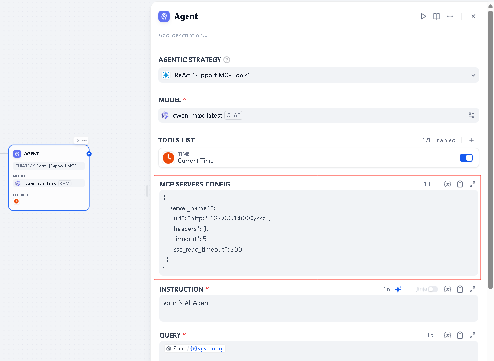

## Dify 1.0 Plugin Support MCP SSE Tools Agent strategies

**Author:** [Junjie.M](https://github.com/junjiem)  
**Version:** 0.0.1  
**Type:** agent-strategy  
**Github Repo:** [https://github.com/junjiem/dify-plugin-agent-mcp_sse](https://github.com/junjiem/dify-plugin-tools-mcp_sse)   
**Github Issues:** [issues](https://github.com/junjiem/dify-plugin-agent-mcp_sse/issues)  


---


### Description

Dify official Agent strategies collection (Support MCP SSE fetch and call tools).

Dify 官方 Agent 策略集合（支持 MCP SSE 发现和调用工具）。





MCP Servers config, support multiple MCP services. The following example:

MCP服务配置，支持多个MCP服务。 如下示例：

```json
{
  "server_name1": {
    "url": "http://127.0.0.1:8000/sse",
    "headers": {},
    "timeout": 5,
    "sse_read_timeout": 300
  },
  "server_name2": {
    "url": "http://127.0.0.1:8001/sse"
  }
}
```


### Installing Plugins via GitHub  通过 GitHub 安装插件

Can install the plugin using the GitHub repository address. Visit the Dify platform's plugin management page, choose to install via GitHub, enter the repository address, select version number and package file to complete installation.

可以通过 GitHub 仓库地址安装该插件。访问 Dify 平台的插件管理页，选择通过 GitHub 安装插件，输入仓库地址后，选择版本号和包文件完成安装。


---


### FAQ

#### How to Handle Errors When Installing Plugins? 安装插件时遇到异常应如何处理？

**Issue**: If you encounter the error message: plugin verification has been enabled, and the plugin you want to install has a bad signature, how to handle the issue?

**Solution**: Add the following line to the end of your .env configuration file: FORCE_VERIFYING_SIGNATURE=false
Once this field is added, the Dify platform will allow the installation of all plugins that are not listed (and thus not verified) in the Dify Marketplace.

**问题描述**：安装插件时遇到异常信息：plugin verification has been enabled, and the plugin you want to install has a bad signature，应该如何处理？

**解决办法**：在 .env 配置文件的末尾添加 FORCE_VERIFYING_SIGNATURE=false 字段即可解决该问题。
添加该字段后，Dify 平台将允许安装所有未在 Dify Marketplace 上架（审核）的插件，可能存在安全隐患。
