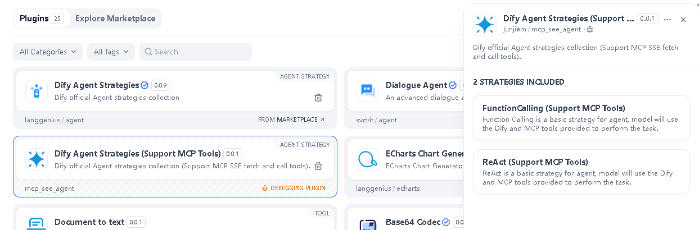
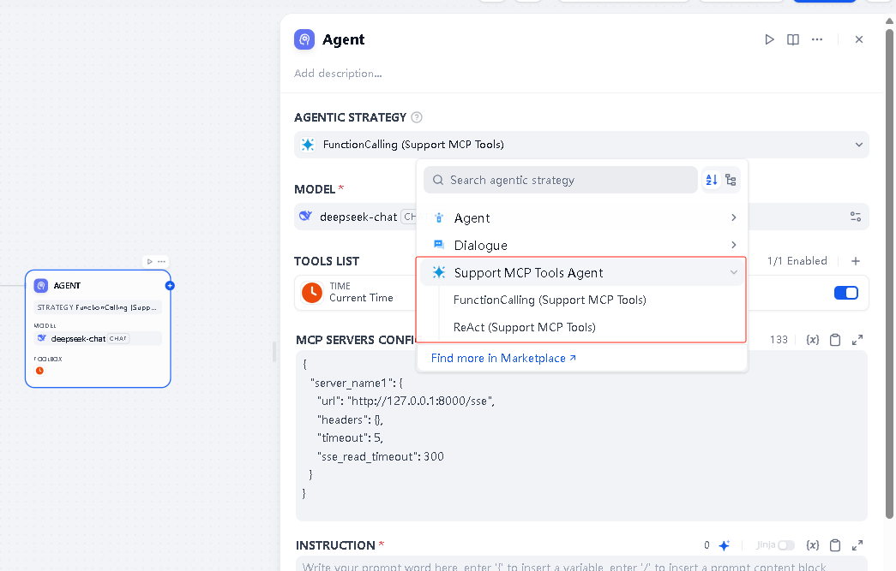
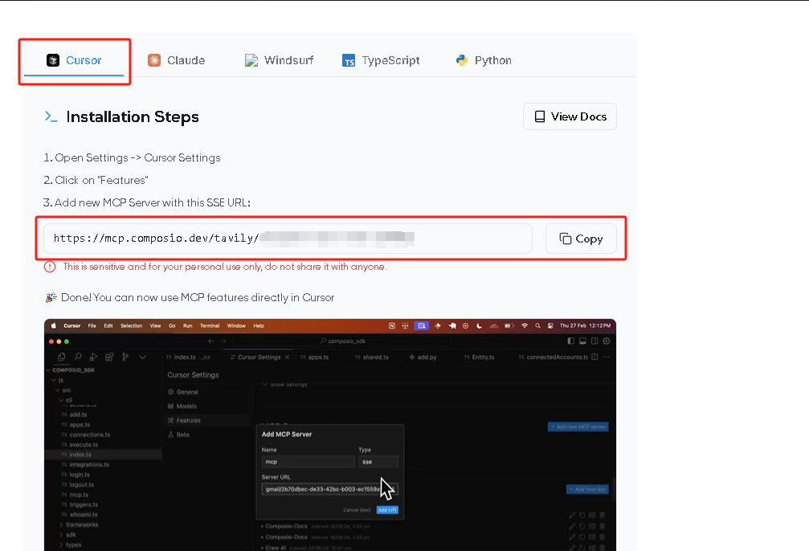
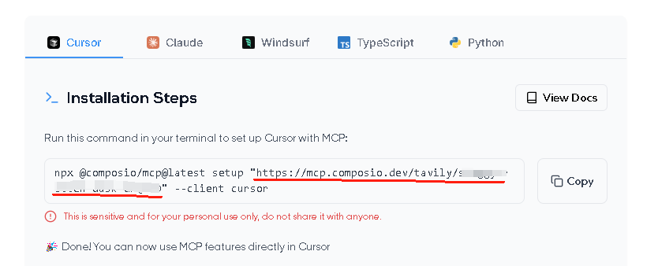
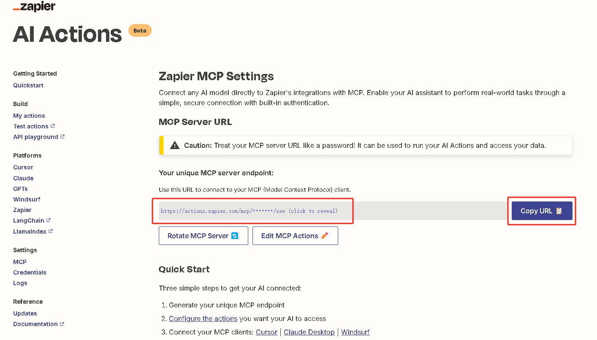
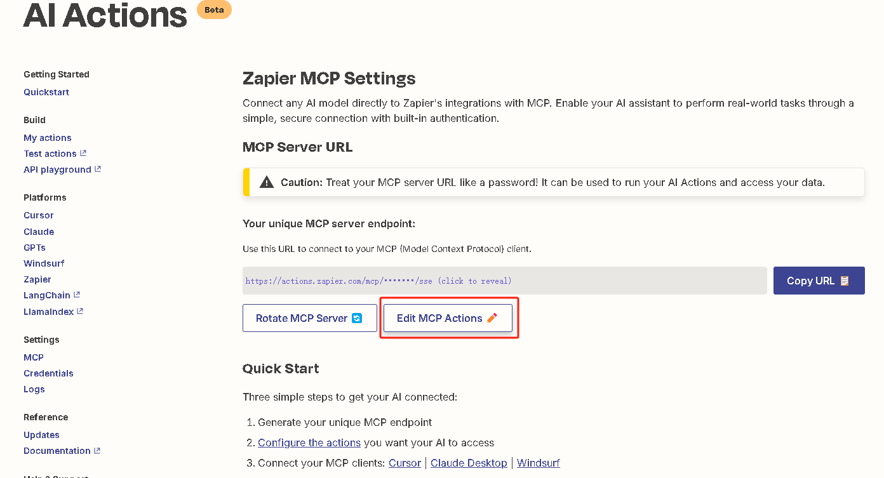
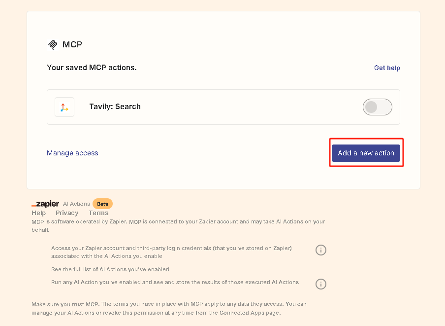
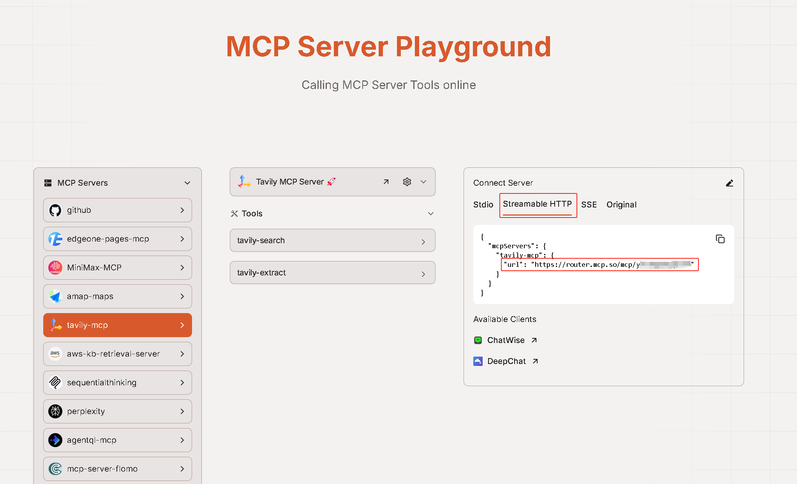
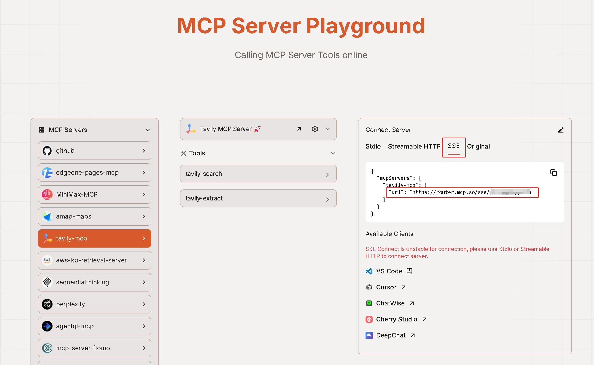

## Dify 1.0 Plugin Support MCP Tools Agent strategies

**Author:** [Junjie.M](https://github.com/junjiem)   
**Type:** agent-strategy  
**Github Repo:** [https://github.com/junjiem/dify-plugin-agent-mcp_sse](https://github.com/junjiem/dify-plugin-agent-mcp_sse)   
**Github Issues:** [issues](https://github.com/junjiem/dify-plugin-agent-mcp_sse/issues)  


---


### Description

Agent strategies collection that provide `Function Calling` and `ReAct` 
(Support `fetch and call tools` by `MCP` protocol through `HTTP with SSE` or `Streamable HTTP` transport).

提供 `Function Calling` 和 `ReAct` 的 Agent 策略集合
（支持通过 `HTTP with SSE` 或 `Streamable HTTP` 传输方式使用 `MCP` 协议来`发现和调用工具`）。






MCP Servers config, support multiple MCP services. The following example:

MCP服务配置，支持多个MCP服务。 如下示例：

```json
{
  "server_name1": {
    "transport": "sse",
    "url": "http://127.0.0.1:8000/sse",
    "headers": {},
    "timeout": 50,
    "sse_read_timeout": 50
  },
  "server_name2": {
    "transport": "sse",
    "url": "http://127.0.0.1:8001/sse"
  },
  "server_name3": {
    "transport": "streamable_http",
    "url": "http://127.0.0.1:8002/mcp",
    "headers": {},
    "timeout": 50
  },
  "server_name4": {
    "transport": "streamable_http",
    "url": "http://127.0.0.1:8003/mcp"
  }
}
```
OR
```json
{
  "mcpServers": {
      "server_name1": {
        "transport": "sse",
        "url": "http://127.0.0.1:8000/sse",
        "headers": {},
        "timeout": 50,
        "sse_read_timeout": 50
      },
      "server_name2": {
        "transport": "sse",
        "url": "http://127.0.0.1:8001/sse"
      },
      "server_name3": {
        "transport": "streamable_http",
        "url": "http://127.0.0.1:8002/mcp",
        "headers": {},
        "timeout": 50
      },
      "server_name4": {
        "transport": "streamable_http",
        "url": "http://127.0.0.1:8003/mcp"
      }
    }
}
```

> **Note:** "transport" parameter as `sse` or `streamable_http`, default `sse`.

> **注：**  "transport" 参数为 `sse` 或 `streamable_http` ，默认为 `sse`。


---


### Managed MCP Servers 托管的MCP服务器

If you want to try MCP but don't know how to deploy SSE transport's MCP Server, can you try connect to Managed MCP Servers.

如果你想尝试 MCP，但是不知道如何部署 SSE 传输的 MCP Server，可以尝试连接托管的 MCP 服务器。

#### Example 1  示例1

[Composio Managed MCP Servers](https://mcp.composio.dev)

[Composio 托管的 MCP 服务器](https://mcp.composio.dev)


Reference Cursor Settings, shown below:

参考 Cursor 设置，如下图：




MCP Servers config, shown below:

MCP 服务配置，如下示例：

```json
{
  "tavily": {
    "url": "https://mcp.composio.dev/tavily/xxxx-xxxx-xxxx-xxxx"
  }
}
```


#### Example 2  示例2

[Zapier Managed MCP Servers](https://actions.zapier.com/settings/mcp)

[Zapier 托管的 MCP 服务器](https://actions.zapier.com/settings/mcp)

Copy the MCP Server URL for use in the Dify plug-in configuration.

复制 MCP Server URL，在 Dify 插件配置中使用。



MCP Servers config, shown below:

MCP 服务配置，如下示例：

```json
{
  "zapier-mcp": {
    "url": "https://actions.zapier.com/mcp/sk-xxxxxxxxxx/sse"
  }
}
```

Click "Edit MCP Actions" to go to the page for adding tools and actions.

点击 “Edit MCP Actions” ，进入工具和操作的添加页面。



Click "Add a new action" to add the required MCP service instance.

点击 “Add a new action”，添加需要的MCP服务实例。



You can also continue to add different actions to enrich the tool set available to the Agent.

你还可以继续添加不同的 Action，丰富 Agent 可用的工具集。


#### Example 3  示例3

[MCP.so Managed MCP Servers](https://mcp.so/playground)

[MCP.so 托管的 MCP 服务器](https://mcp.so/playground)

##### `Streamable HTTP`



MCP Servers config, shown below:

MCP 服务配置，如下示例：

```json
{
  "tavily-mcp": {
    "transport": "streamable_http",
    "url": "https://router.mcp.so/mcp/xxxxxxxxxxx"
  }
}
```

##### `SSE` 



MCP Servers config, shown below:

MCP 服务配置，如下示例：

```json
{
  "tavily-mcp": {
    "url": "https://router.mcp.so/sse/xxxxxxxxxxx"
  }
}
```


---


### Installing Plugins via GitHub  通过 GitHub 安装插件

Can install the plugin using the GitHub repository address. Visit the Dify platform's plugin management page, choose to install via GitHub, enter the repository address, select version number and package file to complete installation.

可以通过 GitHub 仓库地址安装该插件。访问 Dify 平台的插件管理页，选择通过 GitHub 安装插件，输入仓库地址后，选择版本号和包文件完成安装。


---


### FAQ

#### 1. How to Handle Errors When Installing Plugins? 安装插件时遇到异常应如何处理？

**Issue**: If you encounter the error message: plugin verification has been enabled, and the plugin you want to install has a bad signature, how to handle the issue?

**Solution**: Add the following line to the end of your .env configuration file: `FORCE_VERIFYING_SIGNATURE=false`
Once this field is added, the Dify platform will allow the installation of all plugins that are not listed (and thus not verified) in the Dify Marketplace.

**问题描述**：安装插件时遇到异常信息：plugin verification has been enabled, and the plugin you want to install has a bad signature，应该如何处理？

**解决办法**：在 .env 配置文件的末尾添加 `FORCE_VERIFYING_SIGNATURE=false` 字段即可解决该问题。
添加该字段后，Dify 平台将允许安装所有未在 Dify Marketplace 上架（审核）的插件，可能存在安全隐患。


#### 2. How to install the offline version 如何安装离线版本

Scripting tool for downloading Dify plugin package from Dify Marketplace and Github and repackaging [true] offline package (contains dependencies, no need to be connected to the Internet).

从Dify市场和Github下载Dify插件包并重新打【真】离线包（包含依赖，不需要再联网）的脚本工具。

Github Repo: https://github.com/junjiem/dify-plugin-repackaging

